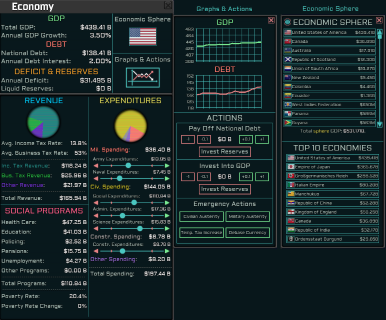

# Final Project Proposal

## Group Members:
Ideas:

Seth Fenton - Jai Shah

This is terribly formatted and lacks photos we added to demonstrate some features, committed a pdf under Proposal-1 with both better formatting and the photos, this is also here but please look at that if you can.

<b>Government Budget Simulator</b>
1. Deficit Clock
2. Government Spending on Different Sectors
3. Subsidies
4. GDP Clock
5. Yfinance4j will be used as a library to bring up basic economic data
6. Give random positive and negative events
7. Print Debt To GDP
8. People happiness value in utils, calculated by taking a standard human development growth curve and adjusting it by gdp per capita using random formula I’ll come up with based on vibes and testing
9. Print trade surplus (negative if deficit)
10. Effectively give people options on how to proceed as standard buttons, they have the goal of keeping happiness up and if it ever reaches zero, game over
closer metaphor is probably like the TNO Mod of hoi 4 but no alt history and no relative focus on the Gui

Verification For Government Budget Simulator:
1. You can run it and check if the numbers are reasonable and respond as you would expect to relatively good and bad economic decisions (see inflation goes down if interest rate goes up and gdp growth rate gets marginally faster if interest rate comes down)
2. You can check if things like real gdp and real gdp per capita are going up and down at roughly the same pace as utils or other populus development indicators like HDI)
3. You can check if increasing the government deficit/surplus has the expected impact on interest rates and government debt
4. Basically you can just play the game and check that things vaguely make sense, you can also scroll through the code quickly and see if we’re randomizing things or calculating them based on player decisions (well almost always do the latter)
5. We’ll include more direct feature descriptions with the prototype doc that will be more specific and make it even easier to check

Though we understand there are some difficulties inherent to evaluating the government budget simulator, we’d really like to do it anyway. It’d just be an incredibly cool thing to program and we both really fell in love with the idea. We are seniors, after AP exams we should have plenty of time to bring this to fruition, and we just want to make something really cool. Also, we’d really love to use the GPT Api in order to pull up a list of country specifications so that the user can play any country in the world and we don’t have to limit them to nations we hardcoded international trade in for. If it’s a no, it’s a no but we still wanted to include a sample image and more information about what we would use it for, just on the off chance that we can change your mind.

<b>Chemical Reaction Simulator</b>

1. Has a databank of reaction constants/characteristics and the capacity to search the web for more (specifically NIST chemical reactants database) https://kinetics.nist.gov/kinetics/
2. Models independent molecules directly on screen using circles of radii determined with a periodic table library (which has to exist), visual effects are probably coded in processing for ease
3. Code in gravity and most other fundamental forces that are easy to calculate, when gases are used leverage ideal gas laws so as to not have to do calculus
4. https://phet.colorado.edu/sims/html/reactants-products-and-leftovers/latest/reactants-products-and-leftovers_all.html (this is pretty bad as a model, we would provide more effective collision modeling and also measured energy changes)
5. https://iwant2study.org/lookangejss/chemistryejss/ejss_model_rate_of_reaction/index.html this is somewhat closer to what we’re going for though again we’d use real molecules so it’d be closer to a combination of the two

<b>Orbital Laser Simulator</b>
1. A straight rip of nuke map, we can use the map interface within java already 
2. Have to do slightly different math with lasers but the display can be fairly similar though likely much more simplified 
3. Six size of laser options + six distance from the surface of the planet options (assume that changes something but not sure, would have to check)  and the ability to customize lasers 
4. Calculate damage based on gas composition of the atmosphere and let the user select gas composition and density
5. Probably much worse graphics
6. https://nuclearsecrecy.com/nukemap/

Challenge Here:
Beyond the map api which unfortunately I don’t think we’re allowed to use, the challenge comes mostly from making the lasers graphically interesting and the calculations surrounding entering the atmosphere and actual destruction (eg. Property damage, death toll).

This is honestly our least favorite idea and if you find these problems insurmountable we’d really rather do one of the other ones anyway.

