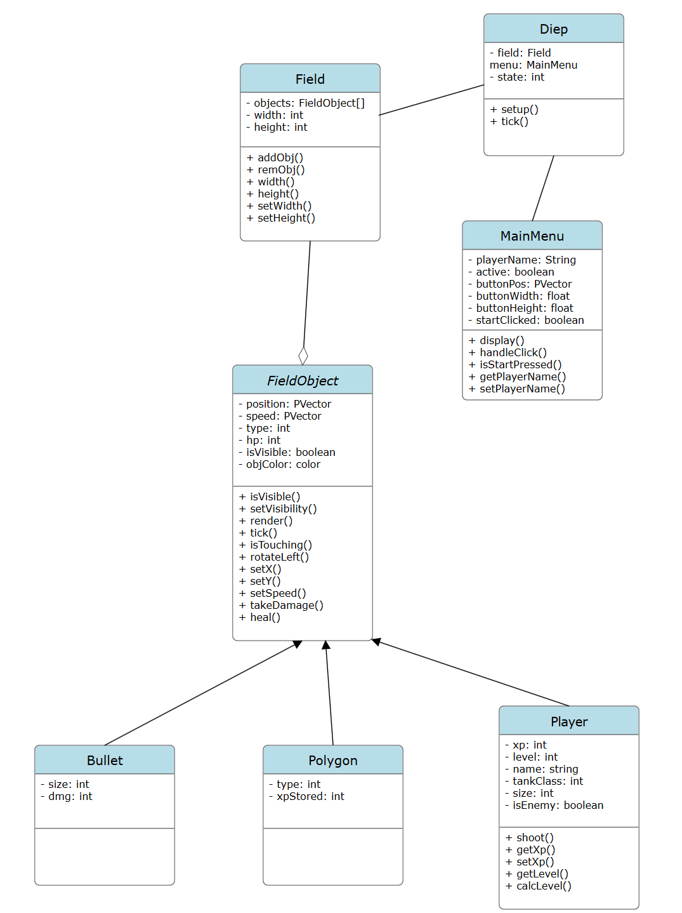

# Technical Details:
Player will be in a center ~~and a map object with reflect the movement of the player. To keep all other objects consistent with the movement of the player the vector of the map movement will be applied onto all other objects.~~ The player and objects will be kept on screen using the translate() function to emulate a map and will be implemented in the general abstract class.

Players will have different tank classes:

Twin: shoots two bullets at a time
Sniper: greater FOV and faster bullets
Machine Gun: faster shooting
Flank Guard: shoot in both directions
     
# Project Design

There will be an abstract class for all movable and renderable objects on the gameplay field, which will be capable of moving, taking/healing damage, turning, detecting each other's touch, becoming visible, and ticking.

At launch, the main menu will display a name input box and a start button. Players can type their name and click the button to begin the game.

Enemies and player objects are the same class; the enemies will be stored in a list, while the player will be a single instance variable.

Players use the WASD keys to move their tank and the mouse to aim and shoot. They will also have to click on buttons for upgrades.

All objects on the field will be stored in the Field class, which contains info like size and also the list of FieldObjects.

Health, weapon damage and rendering will be affected by a player object's type.

Polygons will float around that give xp upon breaking but damage the players on contact.

Enemies will be given basic decision making skills. While the project may be expanded further, this will involve detecting incoming bullets and moving away from them, detecting players and strafe shooting at them, shooting at polygons, and selecting class upgrades when they appear.

Plan for bot AI:

If a bot is peaceful (not locked onto a target): heads in a randomised direction for a random amount of timescans every tick for targets. If something comes within view (a certain radius), it selects it as a target and enters one of the battle modes. If the target dies or leaves view, the bot will randomly select a new visible target, or go peaceful if there is no enemy in sight.

Battle modes: the bot will either strafe (go towards the target while moving back and forth perpendicular to the line of sight to the target) or charge (go sraight to the target and shoot). Each mode will last 3-5 seconds before it is randomised again. If the bot's health gets too low, it will have a chance to retreat, running away from the target.

New UML

# Intended pacing:

Pacing schedule:

May 27: finish abstract FieldObject class
May 28: finish Bullet class
May 29: finish Polygon class
May 30: finish Player class
June 1: Finish upgrade system
